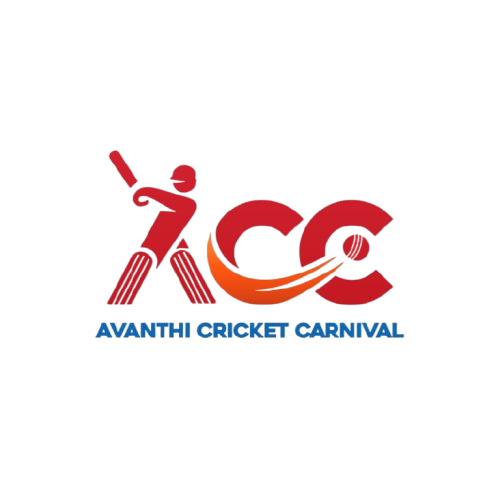
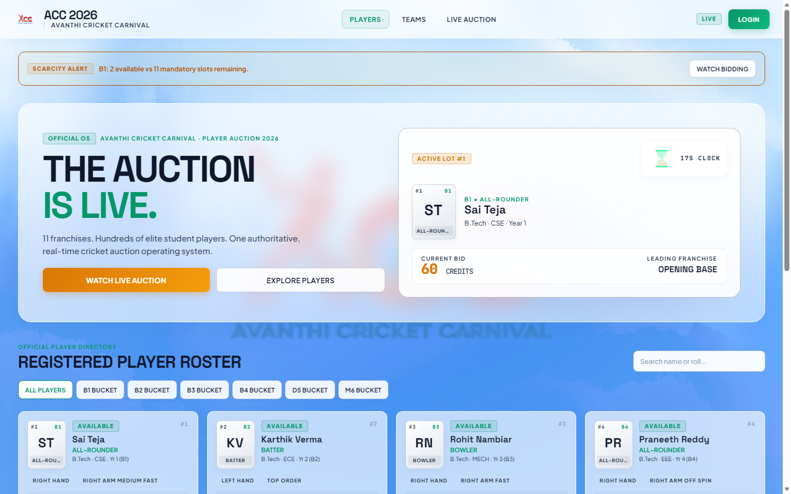
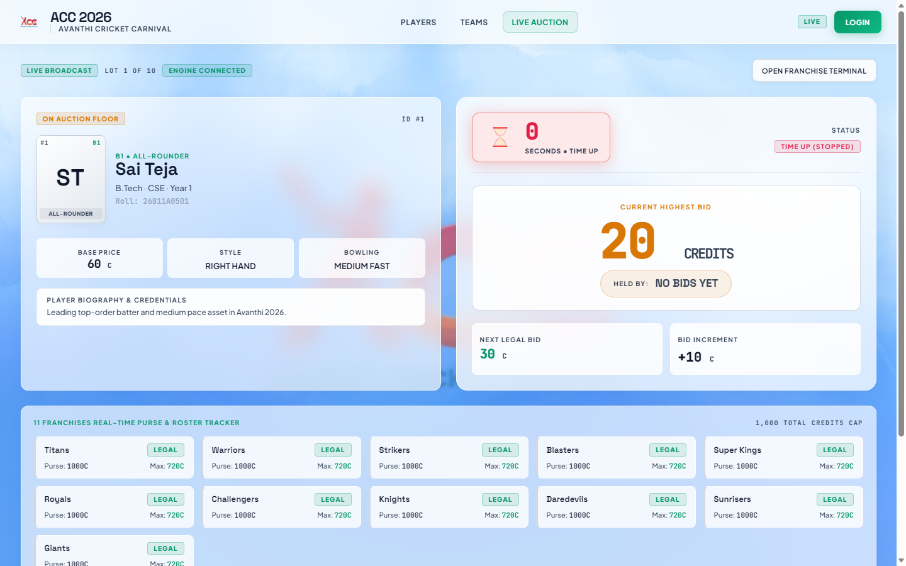
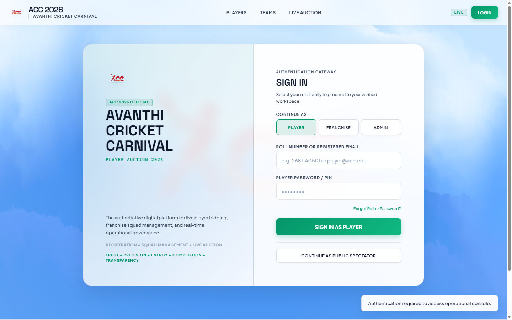
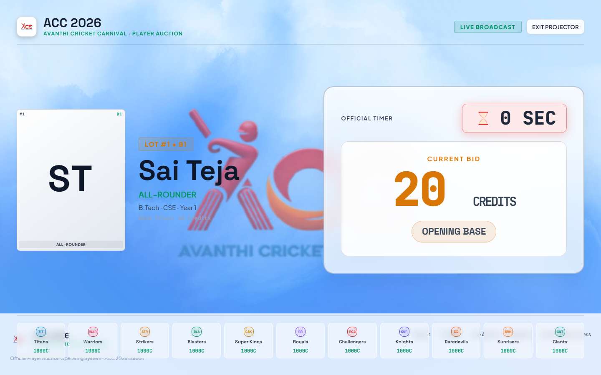
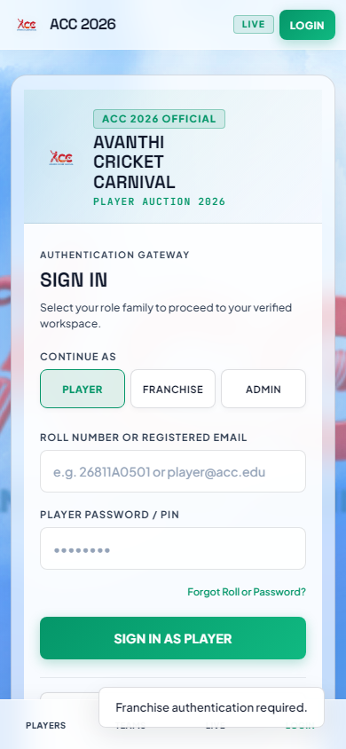
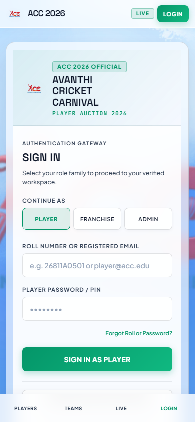

# Avanthi Cricket Carnival (ACC) — Auction Operating System & Portal

<p align="center">
  
</p>

<p align="center">
  <strong>A real-time, multi-portal cricket tournament player auction operating system featuring automated academic roll classification, rigorous purse reserve mathematics, live spectator dashboards, mobile captain terminals, and an auditorium projector display.</strong>
</p>

<p align="center">
  
  
  
  
  
  
  
  
</p>

---

## 📌 Executive Summary

The **Avanthi Cricket Carnival (ACC) Auction Operating System** is an end-to-end, high-reliability auction management platform built for institutional cricket leagues. It bridges the gap between spectator engagement, fast-paced captain bidding, transparent academic quota governance, and high-stakes stage auctioneering.

### Core Highlights
* **Dual-Delivery Architecture**:
  1. **Enterprise Fullstack Stack** (`acc-auction-portal`): Modern React 19 + TypeScript + Vite + Tailwind CSS + Firebase Cloud Functions & Realtime Database.
  2. **Zero-Dependency Standalone OS** (`Acc-Auction-Os.html`): Self-contained single-file engine with embedded SVG textures, full auction loop, and multi-window multi-tab sync via `BroadcastChannel` with zero build step required.
* **Deterministic Mathematical Bidding Engine**: Strict adherence to purse conservation rules, mandatory academic bucket reservations, and automated maximum bid ceiling enforcement.
* **Academic Roll Number Classification**: Automated branch, year, entry type, and quota bucket (B1–B5) derivation from institutional roll IDs.
* **Auditorium-Grade Visuals**: FeralUI pastel glassmorphism with inline SVG turbulence grain textures, tactile feedback, and high-visibility 1440px+ projector mode.
* **Forensic Auditing & Recovery**: Multi-lot atomic UNDO engine with full state rollback (purse, slots, bucket quotas, catalog status) and double-undo prevention.

---

## 📸 System Showcase

| 🏟️ Public Live Dashboard | ⚡ Stage Auctioneer View |
| :---: | :---: |
|  |  |
| *Real-time spectator catalog, lot spotlight, and 11-squad matrix* | *Circular countdown ring, active bidding podium, and bid stream* |

| 🛠️ Operator / Admin Cockpit | 📽️ Auditorium Projector Display |
| :---: | :---: |
|  |  |
| *Hammer controls, skip/pause triggers, forensic undo, audit log* | *1440px+ dark-mode display with 380px photo and giant typography* |

| 📱 Franchise Captain Terminal | 🔐 Secure Role-Based Authentication |
| :---: | :---: |
|  |  |
| *Mobile-first responsive bidding console with legal max-bid cap* | *Role-based security gate for Admins, Captains, and Players* |

---

## 🏛️ The 6 Operational Portals

The ACC system delivers 6 purpose-built personas tailored to every participant in the tournament:

1. **Public Spectator View (`public`)**:
   - Real-time catalog of all registered athletes with live search and filtering.
   - Dynamic bucket tabs (`ALL`, `B1`, `B2`, `B3`, `B4`, `B5`).
   - 11-team franchise squad matrix displaying purse spent, slots filled, and bucket fulfillment status.

2. **Live Auction View (`live`)**:
   - Real-time active lot podium showcasing the 200×230 portrait, player tier, and base price.
   - High-precision circular SVG countdown timer (30s opening, 20s bid-reset).
   - Live bidding log streaming latest increments, leading bidder, and franchise badges.

3. **Franchise Captain Bidding Console (`franchise`)**:
   - Mobile-first responsive layout tailored for captain smartphones and tablets.
   - Real-time calculation of remaining purse, current squad count, and legal maximum bid cap.
   - One-tap incremental bidding button with automatic disablement when bids exceed legal limits or after passing.
   - Reversible pass mechanism allowing teams to re-enter bidding prior to the hammer falling.

4. **Player Registration Portal (`player`)**:
   - Real-time roll number parser with immediate academic program and bucket validation.
   - Dynamic cricket questionnaire with conditional branching (Batting style/order, Bowling style/pace, Wicket-keeping).
   - Automated player type derivation (`Wicket-Keeper Batter`, `All-Rounder`, `Batter`, `Bowler`, `Fielder`).
   - Direct CricHeroes profile verification link and privacy-shielded phone handling.

5. **Admin / Auctioneer Control Center (`admin`)**:
   - Authoritative auctioneer controls: **Start Lot**, **Pause / Resume**, **Skip Lot**, and **Hammer Sale**.
   - Two-step hammer confirmation dialog displaying winning franchise, hammer price, and lot ID.
   - Forensic multi-lot UNDO engine with idempotent state rollback and audit streaming.
   - One-click CSV squad export and full plain-text audit trail download.

6. **Auditorium Projector Display (`projector`)**:
   - High-contrast cinema aesthetic (`#0B0F19`) engineered for 1440px+ auditorium projectors.
   - Giant 380px portrait frame, 220px animated timer ring, and massive typography legible across large halls.
   - Synchronized bottom status strip tracking all 11 franchise budgets and active bids.

---

## 📐 Mathematical Bidding Engine & Rules

The auction operates under strict financial and academic regulations designed to guarantee fair play and complete roster legality:

### 1. Mandatory Purse Reserve Formula
To ensure every franchise retains sufficient purse to fulfill the mandatory 15-player minimum squad requirement and all mandatory quota buckets, the maximum legal bid is calculated dynamically before every bid:

$$\text{mandatoryAfterLot} = \max\left(0, \text{unmetBuckets} - \Delta_{\text{bucket}}\right)$$

$$\text{regularSlotsAfterLot} = \max\left(0, 15 - (\text{bought} + 1)\right)$$

$$\text{reserveRequired} = \max\left(\text{mandatoryAfterLot}, \text{regularSlotsAfterLot}\right) \times 20\text{ credits}$$

$$\mathbf{maxBid} = \max\left(0, \text{purse} - \text{reserveRequired}\right)$$

### 2. Rule 12.2 Mandatory Slot Protection
A bid is legally blocked if placing that bid would leave the franchise with fewer open slots than the number of unmet mandatory academic buckets:
$$\text{isEligible} = (\text{mandatoryAfterLot} \le \text{slotsAfterLot})$$

### 3. Progressive Price Escalation Ladder
Bids advance in structured increments without arbitrary price skipping:
* **Current Bid < 100 Credits**: $+10$ credits per bid
* **Current Bid 100 – 199 Credits**: $+20$ credits per bid
* **Current Bid ≥ 200 Credits**: $+30$ credits per bid

### 4. Dual-Mode Auction Timer
* **Initial Lot Opening**: 30-second countdown.
* **On Every Valid Bid**: Timer resets to 20 seconds.
* **Urgency Visuals**: At $\le 5$ seconds, the circular ring pulses in warning amber; at 0 seconds, bidding locks pending the auctioneer's hammer decision.

---

## 🎓 Academic Roll Parser & Quota Buckets

Institutional rules require representation across academic years and programs. The system includes a deterministic roll number parser:

| Pattern | Program | Academic Year Derivation | Target Bucket |
| :--- | :--- | :--- | :--- |
| `YY811Abbnn` | B.Tech Regular | $(26 - YY) + 1$ (1st to 4th Year) | **B1 – B4** |
| `YY815Abbnn` | B.Tech Lateral Entry | $(26 - YY) + 2$ (2nd to 4th Year) | **B2 – B4** |
| `YY597-BB-nnn` | Diploma | $(26 - YY) + 1$ | **B5 strictly** |
| `PG-*` | M.Tech / MBA / MCA | Post-Graduate | **Unbucketed Open Pool** |

*Freshers Trigger*: When admission year $YY = 26$, a mandatory campus referral disclosure is presented in the registration flow.

---

## 🗂️ Project Directory Structure

```text
ACC/
├── Acc-Auction-Os.html               # Complete zero-dependency standalone application
├── index.html                        # Root web entrypoint
├── acc-logo.png                      # Official tournament emblem
│
├── acc-auction-portal/               # Fullstack React + Vite + Firebase application
│   ├── client/                       # React 19 UI application
│   │   ├── src/
│   │   │   ├── components/           # UI components, Radix wrappers, Glass cards
│   │   │   ├── pages/                # Public, Live, Franchise, Player, Admin views
│   │   │   ├── hooks/                # Real-time state and auction listeners
│   │   │   └── lib/                  # Utility functions and style tokens
│   │   └── index.html                # Vite client HTML template
│   ├── functions/                    # Firebase Cloud Functions (TypeScript)
│   │   └── src/                      # Admin actions, bid validators, lot controllers
│   ├── shared/                       # Shared models, validation schemas, and bid engine
│   │   ├── engine/                   # Bid logic, roll parser, eligibility validators
│   │   └── types/                    # Shared TypeScript contracts
│   ├── firebase.json                 # Firebase Hosting and Functions configuration
│   ├── firestore.rules               # Security rules for Cloud Firestore
│   ├── database.rules.json           # Realtime Database synchronization security rules
│   └── package.json                  # Dependencies and build scripts
│
├── tests/                            # Comprehensive Test & Verification Suite
│   ├── e2e_auction_test.js           # End-to-end full auction simulation
│   ├── test_admin_and_player_portal.js
│   ├── test_auth_scale_500.js        # High-concurrency authentication stress test
│   ├── test_aspect_ratio_and_live_badge.js
│   ├── test_realtime_and_presence.js # Realtime synchronization verification
│   └── test_redteam_remediation.js   # Security and edge-case validation
│
├── restored_html/                    # Baseline design artifacts and prototypes
│   ├── Admin.html
│   ├── Franchise-Bidding.html
│   ├── Live.html
│   └── Projector.html
│
├── .gitignore                        # Standard Git ignore rules (node_modules, dist, etc.)
└── README.md                         # Project documentation
```

---

## 🚀 Getting Started

You can run the project in either of two ways:

### Mode 1: Instant Standalone (No Node.js Required)
The quickest way to run the entire auction system:
1. Simply double-click [`Acc-Auction-Os.html`](Acc-Auction-Os.html) in your browser (Chrome, Edge, Firefox, Safari).
2. Or serve it via any static file server:
   ```bash
   npx serve .
   # or
   python -m http.server 8080
   ```
3. Open multiple tabs across different views (`#public`, `#live`, `#franchise`, `#admin`, `#projector`) to experience instant multi-screen synchronization powered by the Web `BroadcastChannel` API.

---

### Mode 2: Modern React Fullstack Portal (`acc-auction-portal`)

#### Prerequisites
* [Node.js](https://nodejs.org/) (v18 or higher)
* [pnpm](https://pnpm.io/) (v9 or higher recommended)

#### 1. Install Dependencies
```bash
cd acc-auction-portal
pnpm install
```

#### 2. Configure Environment Variables
Copy `.env.example` to `.env`:
```bash
cp .env.example .env
```
Fill in your Firebase credentials:
```env
VITE_FIREBASE_API_KEY="your-api-key"
VITE_FIREBASE_AUTH_DOMAIN="your-project.firebaseapp.com"
VITE_FIREBASE_PROJECT_ID="your-project-id"
VITE_FIREBASE_STORAGE_BUCKET="your-project.appspot.com"
VITE_FIREBASE_MESSAGING_SENDER_ID="your-sender-id"
VITE_FIREBASE_APP_ID="your-app-id"
VITE_FIREBASE_DATABASE_URL="https://your-project-default-rtdb.firebaseio.com"
```

#### 3. Run Development Server
```bash
pnpm dev
```
The application will launch at `http://localhost:5173`.

#### 4. Build for Production
```bash
pnpm build
```

---

## 🧪 Testing & Quality Assurance

The repository includes a comprehensive automated test suite validating business rules, roll parsing, real-time presence, and security constraints:

### Run Full Test Suite
```bash
# Run unit and integration engine tests
cd acc-auction-portal
pnpm test

# Run end-to-end auction flow test
node tests/e2e_auction_test.js

# Run presence and realtime sync verification
node tests/test_realtime_and_presence.js

# Run security redteam verification
node tests/test_redteam_remediation.js
```

---

## 🎨 Design Philosophy: FeralUI & Frosted Glass

The user interface adheres to the modern **FeralUI Pastel Glass** design system:
* **Atmospheric Canvas**: 5-layer radial gradient blend (`#F6F9FF` Misted Sky, `#9BE0E8` Rain Indigo, `#C4B5F7` Lavender, `#F8B8D9` Lilac Paper) fused with an inline SVG turbulence noise filter (`<filter id="feralui-grain">`).
* **Frosted Glass Cards**: `backdrop-filter: blur(24px)` with semi-translucent light fills (`rgba(255, 255, 255, 0.72–0.88)`), subtle 1px border glows, and crisp drop shadows.
* **Ergonomics & Accessibility**: Strict WCAG AA contrast (minimum 4.5:1 ratio) on typography (`#0F172A`), minimum 48px touch targets for mobile accessibility, and custom vector SVGs replacing raw emoji glyphs.

---

## 📄 License

This project is licensed under the [MIT License](LICENSE).

---

<p align="center">
  Crafted with precision for the <strong>Avanthi Cricket Carnival (ACC)</strong> 🏏
</p>
