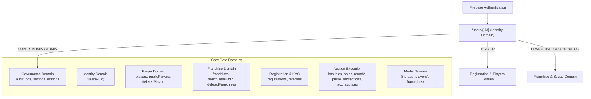

# ACC 2026 — Firebase Data Architecture Specification

## 1. Executive Summary & Domain Architecture
The ACC 2026 Cricket Auction Portal architecture is partitioned into authoritative, isolated data domains backed by Cloud Firestore, Firebase Authentication, and Firebase Storage. Security rules (`firestore.rules`) strictly enforce role-based access control (RBAC), and server-side Cloud Functions handle privileged state mutations (auction mechanics, record management, data wiping).

---

## 2. Exhaustive Data Domain Mapping

### 2.1 Identity Domain
- **Collections**:
  - `/users/{uid}`: Canonical profile and authoritative role.
  - Role Schema: `SUPER_ADMIN`, `ADMIN`, `PLAYER`, `FRANCHISE_COORDINATOR`, `FRANCHISE_TEAM_LEADER`, `GUEST`.
- **Foreign Keys**:
  - `uid`: Matches Firebase Auth UID (`request.auth.uid`).
  - `franchiseId`: References `franchises/{id}` (if coordinator/leader).
  - `playerId`: References `players/{id}` (if player).
- **Access Rules**:
  - Read: Authenticated user read own doc; Admins read all.
  - Write: Only Super Admin and Admin can update roles; users may update display details.
- **Wipe Policy**:
  - `SUPER_ADMIN` and `ADMIN` documents are **STRICTLY PROTECTED** and never deleted.
  - `PLAYER`, `FRANCHISE_COORDINATOR`, and other participant role documents are purged during a complete wipe.

### 2.2 Player Domain
- **Collections**:
  - `players`: Authoritative player profiles (personal details, base price, category, status).
  - `publicPlayers` / `playersPublic`: Sanitized read-only projections for public spectator views.
  - `deletedPlayers`: Soft-deleted / trash archive collection with audit metadata.
  - `playerUniqueKeys`: Uniqueness tracking (phone/email hash) to prevent duplicate registrations.
- **Foreign Keys**:
  - `id`: Canonical Player ID (e.g. `P101`, `PL-2026-XXXX`).
  - `userId`: References `/users/{uid}`.
  - `franchiseId`: Assigned franchise ID once acquired/sold.
- **Access Rules**:
  - Read: Public projections readable by anyone; authoritative `players` restricted to Admins and assigned team coordinators.
  - Write: Admin-only or Cloud Functions.
- **Wipe Policy**:
  - Completely purged across all player collections during dataset wipe.

### 2.3 Franchise Domain
- **Collections**:
  - `franchises`: Authoritative franchise records (name, code, purseRemaining, maxPlayers, slot counts, status).
  - `franchisesPublic`: Sanitized public projections.
  - `deletedFranchises`: Soft-deleted / trash archive collection.
  - `franchiseUsers`: Index mapping coordinator/leader UID to franchise ID.
- **Foreign Keys**:
  - `id`: Canonical Franchise ID (e.g. `FR-01`, `CSK`).
  - `coordinatorUid`, `teamLeaderUid`: References `/users/{uid}`.
- **Access Rules**:
  - Read: Public projections world-readable; authoritative readable by Admins and franchise staff.
  - Write: Admin-only or Cloud Functions.
- **Wipe Policy**:
  - Completely purged during dataset wipe.

### 2.4 Registration & Verification Domain
- **Collections**:
  - `registrations`: Applications submitted via public or internal forms, payment screenshot URLs, verification status (`PENDING`, `VERIFIED`, `REJECTED`).
  - `referrals` / `playerReferrals`: Coordinator referral declarations, conflict tags.
- **Foreign Keys**:
  - `registrationId`: Canonical UUID.
  - `playerId`: Linked player record if approved.
  - `referredBy`: Coordinator UID or code.
- **Access Rules**:
  - Read/Write: Applicant reads/writes pending; Admins review and transition status.
- **Wipe Policy**:
  - Completely purged during dataset wipe.

### 2.5 Payments Domain
- **Collections & Fields**:
  - Handled via `registrations.payment` or standalone `payments` receipts.
  - Stores transaction UTR, receipt screenshot Storage path, and verification timestamp.
- **Wipe Policy**:
  - Purged during dataset wipe when associated with wiped participants.

### 2.6 Auction Operations Domain
- **Collections**:
  - `lots`: Current, upcoming, and completed player auction lots.
  - `bids`: Complete audit trail of every bid placed during the live session.
  - `acquisitions` / `sales`: Finalized auction purchase records.
  - `round2`, `round2Records`, `round2Selections`: Unsold player re-auction nominations and allocations.
  - `allotments`: Squad slot mapping and squad lists.
  - `purseTransactions`, `purseLedger`, `franchiseTransactions`, `transactions`: Immutable balance adjustments and deductions.
  - `auctionHistory`: Historical timeline of lot transitions.
  - `acc_auctions/{editionId}` (e.g. `acc_auctions/acc-2026`, `acc_auctions/live`): Live auction state engine document (activeLotId, timer, status).
- **Access Rules**:
  - Read: World-readable for live auction feed.
  - Write: Cloud Functions only (`placeBid`, `sellPlayer`, `unsoldPlayer`, `undoSale`, `nextLot`).
- **Wipe Policy**:
  - All operational auction documents (lots, bids, sales, round2, purse transactions) are deleted.
  - Live auction state document is reset to `{ status: 'IDLE', activeLot: null, currentBid: null, updatedBy: 'WIPE_SERVICE' }`.

### 2.7 Governance & Audit Domain
- **Collections**:
  - `auditLogs`: Authoritative, tamper-evident security and administrative event ledger.
  - `auditLog`: Legacy audit collection.
  - `settings`: System flags, demo modes, wipe locks (`settings/data_wipe_lock`).
  - `editions`: Edition metadata (`editions/acc-2026`).
- **Access Rules**:
  - Read: Super Admin and Admin only.
  - Write: Cloud Functions write `auditLogs` with admin claims. Client writes strictly prohibited by rules.
- **Wipe Policy**:
  - `auditLogs` is **NEVER DELETED**. It receives a permanent audit record of the wipe event with caller identity, IP, timestamp, and affected record counts.
  - `settings` are preserved, updating only lock flags.

### 2.8 Media Domain (Firebase Storage)
- **Storage Paths**:
  - `/players/{id}/*`: Player profile photos and verification documents.
  - `/franchises/{id}/*`: Franchise logos and banners.
  - `/coordinators/{id}/*`: Coordinator headshots.
  - `/backups/*`: Pre-wipe database JSON snapshots.
- **Access Rules**:
  - Read: Public read for avatars; private for ID proofs.
  - Write: Admin and authenticated owners.
- **Wipe Policy**:
  - Prefix deletion for `/players/`, `/franchises/`, and `/coordinators/`. Backups remain preserved.

---

## 3. Edition Scoping & Isolation
- Default Tournament Edition: `acc-2026`.
- Storage and Firestore records belonging to other editions (e.g. `acc-2025`, `acc-2027`) or system governance are strictly isolated.
- The `wipeParticipantDataset` engine validates that the targeted edition is explicitly confirmed by the Super Admin before performing atomic chunked deletions.
