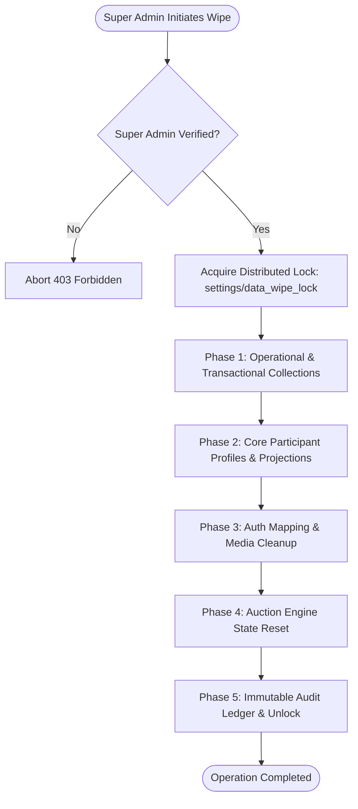

# ACC 2026 — Firebase Deletion Dependency Map

## 1. Overview & Deletion Phasing
A naive deletion script risks leaving orphaned records (e.g. auction bids pointing to non-existent lots or franchise ledgers with invalid balance reconciliations). 
The `wipeParticipantDataset` Cloud Function executes deletion across three phased tiers using bounded 400-document batches to stay well within Firestore's 500-operation transaction/batch limit.

---

## 2. Dependency Execution Phases

### Phase 1: Operational, Transactional & Auction Records
Delete dependent operational data first so no live bids or round-2 nominations refer to vanishing participants.

| Step | Collection Name | Purpose | Batch Size | Action |
|:---|:---|:---|:---|:---|
| 1.1 | `bids` | Live bid history | 400 | Complete batch delete |
| 1.2 | `lots` | Auction player lots | 400 | Complete batch delete |
| 1.3 | `sales` / `acquisitions` | Sold records & sale lots | 400 | Complete batch delete |
| 1.4 | `round2` | Round 2 nominations | 400 | Complete batch delete |
| 1.5 | `round2Records` | Round 2 operational state | 400 | Complete batch delete |
| 1.6 | `round2Selections` | Round 2 picks | 400 | Complete batch delete |
| 1.7 | `allotments` | Squad allotment entries | 400 | Complete batch delete |
| 1.8 | `purseTransactions` | Balance debits/credits | 400 | Complete batch delete |
| 1.9 | `purseLedger` | Franchise purse ledger | 400 | Complete batch delete |
| 1.10 | `franchiseTransactions` | Legacy transaction log | 400 | Complete batch delete |
| 1.11 | `transactions` | Generic financial logs | 400 | Complete batch delete |
| 1.12 | `auctionHistory` | Lot transition timeline | 400 | Complete batch delete |

### Phase 2: Participant Profiles & Application Projections
Delete player and franchise records once their auction ties are severed.

| Step | Collection Name | Purpose | Batch Size | Action |
|:---|:---|:---|:---|:---|
| 2.1 | `players` | Canonical player registry | 400 | Complete batch delete |
| 2.2 | `publicPlayers` / `playersPublic`| Public spectator views | 400 | Complete batch delete |
| 2.3 | `deletedPlayers` | Trash archive | 400 | Complete batch delete |
| 2.4 | `playerUniqueKeys` | Phone/email deduplication | 400 | Complete batch delete |
| 2.5 | `registrations` | Registration submissions | 400 | Complete batch delete |
| 2.6 | `referrals` / `playerReferrals` | Coordinator declarations | 400 | Complete batch delete |
| 2.7 | `franchises` | Canonical franchise docs | 400 | Complete batch delete |
| 2.8 | `franchisesPublic` | Public franchise projections | 400 | Complete batch delete |
| 2.9 | `deletedFranchises` | Franchise trash archive | 400 | Complete batch delete |
| 2.10 | `franchiseUsers` | Coordinator/lead index | 400 | Complete batch delete |

### Phase 3: Identity & Media Cleanup
Delete participant user accounts while preserving administrator identities.

| Step | Target Resource | Preservation Filter | Action |
|:---|:---|:---|:---|
| 3.1 | `/users/{uid}` | `role in ['SUPER_ADMIN', 'ADMIN']` is preserved | Filtered batch delete |
| 3.2 | Storage `players/` | None | Recursive prefix delete |
| 3.3 | Storage `franchises/` | None | Recursive prefix delete |
| 3.4 | Storage `coordinators/` | None | Recursive prefix delete |

### Phase 4: State Document Reset
Reset tournament auction engine documents to pristine IDLE states rather than deleting the configuration documents.
- `acc_auctions/acc-2026`: Set to `{ status: 'IDLE', activeLot: null, currentBid: null, updatedBy: 'WIPE_SERVICE', updatedAt: timestamp }`.
- `acc_auctions/live`: Reset identically.
- `editions/acc-2026/auction/state`: Reset identically.

### Phase 5: Tamper-Evident Audit & Release Lock
1. Write audit log to `auditLogs` with:
   - `action`: `WIPE_ALL_PARTICIPANT_DATA`
   - `performedBy`: Authenticated Super Admin UID and email
   - `editionId`: Selected edition
   - `counts`: Actual deleted count breakdown
   - `timestamp`: Server timestamp
2. Release distributed lock at `settings/data_wipe_lock`.

---

## 3. Protected Resources Matrix

| Resource | Collection / Path | Protection Guarantee |
|:---|:---|:---|
| Super Admin Accounts | `/users/{uid}` where `role == 'SUPER_ADMIN'` | **Immune from deletion.** |
| Admin Accounts | `/users/{uid}` where `role == 'ADMIN'` | **Immune from deletion.** |
| Security Audit Ledger | `auditLogs` | **Immune from deletion.** Wipes are appended. |
| Tournament Settings | `settings/*` (except temporary wipe locks) | **Preserved.** |
| Edition Config | `editions/acc-2026` metadata | **Preserved.** |
| Storage Backups | `backups/*` | **Preserved.** |
